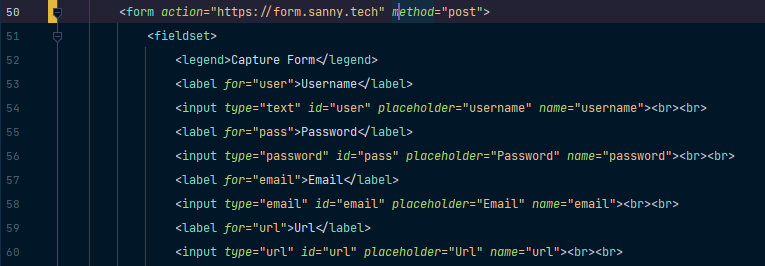
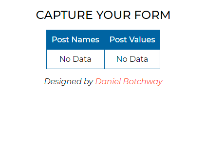

## CaptureForm
 Test and capture your form data in development

You can simply use it by adding "https://form.sanny.tech" in the value of the form action attribute or field.

- link : https://form.sanny.tech

For instance;

Also make sure to indicate your name attributes.

### Interface

Make sure you are using the "_https_" protocol to begin your url.